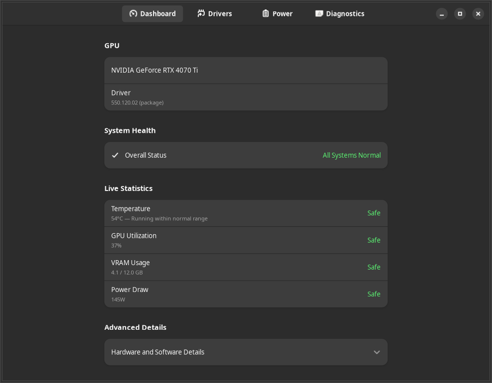
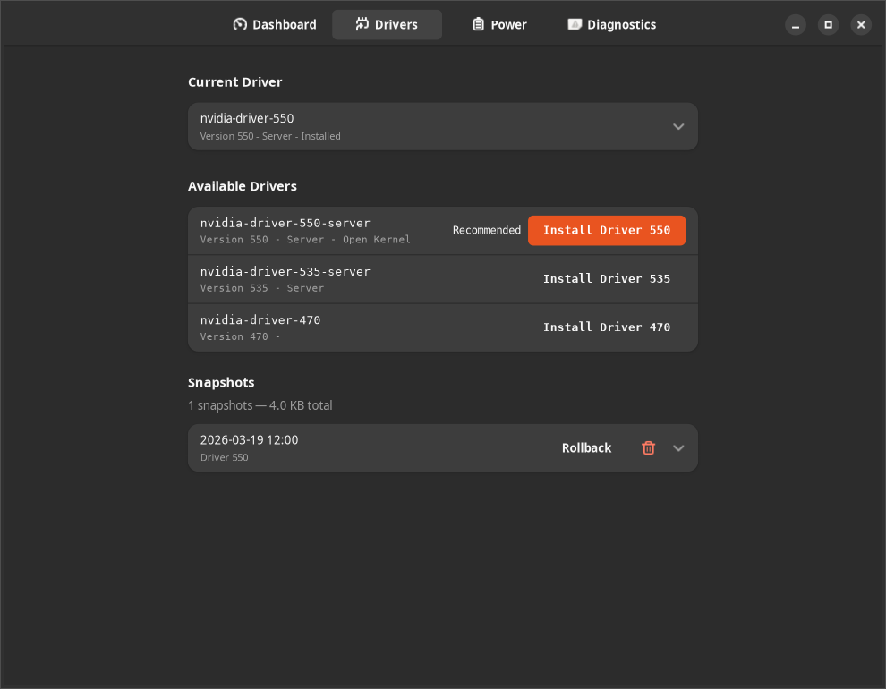
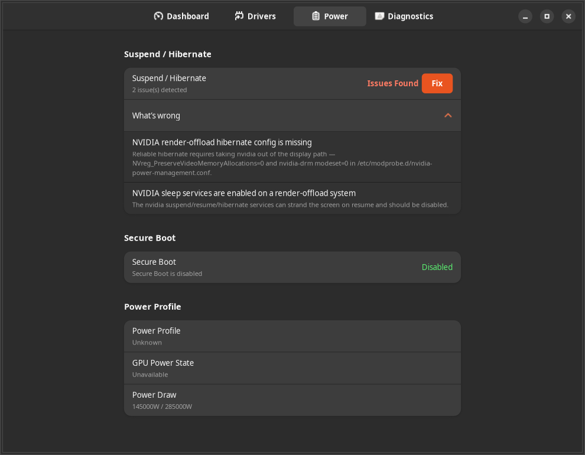
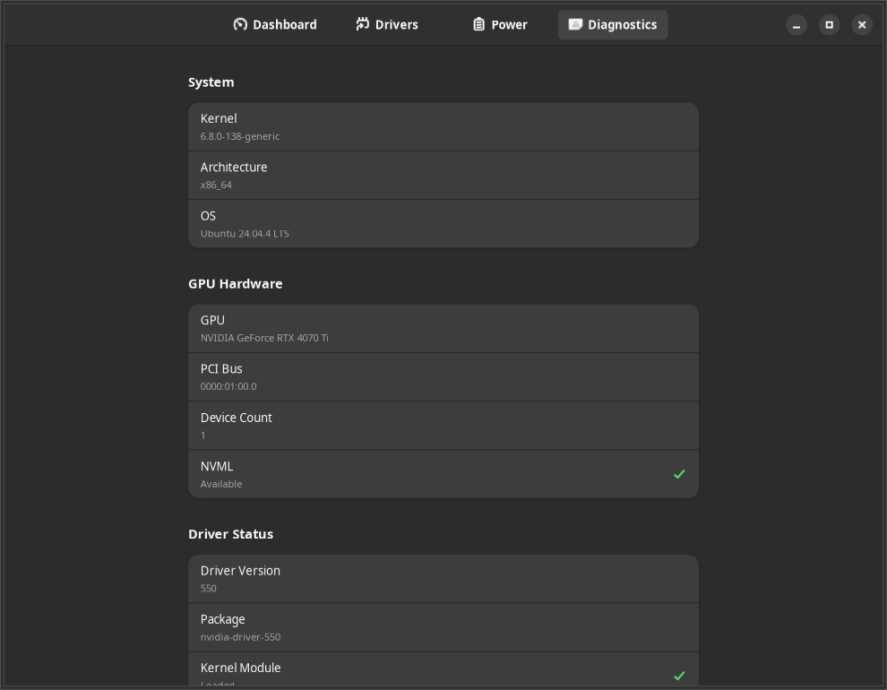

<div align="center">

# Verde

**Safe NVIDIA GPU management for Ubuntu — without the terminal**

Monitor your GPU, install and roll back drivers, and fix suspend/hibernate issues, all from a clean GTK interface.

[](https://www.gnu.org/licenses/gpl-3.0)
[](https://github.com/MohammedEl-sayedAhmed/verde/actions)
[](https://github.com/MohammedEl-sayedAhmed/verde/stargazers)
[](https://github.com/MohammedEl-sayedAhmed/verde/graphs/traffic)
[](https://ubuntu.com)
[](https://www.nvidia.com)
[](https://www.gtk.org)
[](https://python.org)
[](https://github.com/astral-sh/ruff)
[](https://mypy-lang.org)
[](https://github.com/PyCQA/bandit)

</div>

---

Verde is a graphical NVIDIA GPU manager for Ubuntu, built around a **strict privilege boundary**. The GUI you click runs as your normal user and has *zero* system access; everything privileged — installing drivers, editing `/etc`, rebuilding the initramfs — happens in a separate, **systemd-sandboxed daemon** that runs as root and authorizes every action through **Polkit**. Before any change, Verde takes a **snapshot** you can roll back to, records the change so it can be reverted, and writes it to an **append-only audit log**. It's the kind of tool you can hand to someone who would never open a terminal — and trust on your own machine.

> [!NOTE]
> Verde is in early development (`0.1.0`) and currently targets **Ubuntu 24.04 + NVIDIA**. A PPA is on the way.

## Screenshots

<div align="center">

| | |
|:---:|:---:|
|  |  |
| **Dashboard** — live GPU health & stats | **Drivers** — install, switch & roll back |
|  |  |
| **Power** — Optimus-aware suspend/hibernate | **Diagnostics** — shareable system report |

<sub>Shown in dark theme; Verde follows your system light/dark preference.</sub>

</div>

## Features

### Monitoring

- **Real-time GPU stats** — temperature, utilization, VRAM, power draw, fan speed, and clock speeds
- **Plain-language status** — raw values translated into "Normal / Warm / Hot", P-state explanations, and VRAM pressure
- **Degraded-state awareness** — clearly distinguishes *no driver*, *driver not loaded*, *GPU off bus*, and healthy states
- **Graceful fallback** — when the driver isn't loaded, GPU detection falls back to `/sys/bus/pci` so you still see your card

### Driver Management

- **Discover & install** — lists available NVIDIA drivers via `ubuntu-drivers` and installs with live progress
- **Pre-flight safety checks** — verifies disk space, network, and apt/dpkg lock state *before* touching anything
- **One-click rollback** — every install is snapshotted first, so you can return to the previous working driver
- **dpkg repair** — recover a broken package state without hand-running `dpkg --configure -a`

### Safety & Recovery

- **Automatic snapshots** — pre-operation driver state captured before every change
- **System modification tracking** — a manifest of everything Verde changed, each entry individually revertible
- **External change detection** — notices when drivers or config were changed *outside* Verde (SHA-256 baseline)
- **Crash recovery** — interrupted operations are detected on the next start; a standalone `verde-daemon --repair` mode exists for the worst case

### Power & Suspend

- **Suspend/hibernate diagnosis** — detects the common NVIDIA suspend/hibernate/Wayland breakages
- **Optimus / PRIME aware** — detects the display profile via `prime-select` and applies the *right* fix: on render-offload laptops (where the NVIDIA GPU drives no displays) it takes nvidia out of the display path (`modeset=0`, sleep services disabled); GPUs that drive displays get the standard fix. See the [Optimus render-offload notes](docs/nvidia-gpu-hibernate-ubuntu2404.md)
- **One-click fixes** — writes the correct `modprobe` config and enables or disables the `nvidia-suspend`/`resume`/`hibernate` services to match your profile, then rebuilds the initramfs
- **Module doctor** — explains *why* the kernel module won't load (missing headers, DKMS, kernel mismatch, Secure Boot, blacklisting) and fixes it

### Diagnostics

- **Shareable reports** — generate a comprehensive Markdown/JSON system report for forum posts and bug reports
- **Audit log viewer** — browse every operation Verde performed, with filtering and export
- **CLI health check** — `verde --check` returns machine-readable exit codes for scripts and monitoring

### Security & Architecture

- **GUI/daemon split** — the GUI never touches system resources; all authority lives behind D-Bus
- **Polkit-gated** — every privileged action is authorized per-caller, with tiered policies
- **Hardened daemon** — `ProtectSystem=strict`, `PrivateTmp`, `MemoryDenyWriteExecute`, `SystemCallFilter`, and more
- **No `shell=True`, ever** — all subprocess calls use argument lists; enforced in CI
- **Rate limited & validated** — token-bucket per caller; regex + length + null-byte checks on every D-Bus argument

## Requirements

- Ubuntu 24.04 (Noble Numbat)
- An NVIDIA GPU
- Python 3.12
- GTK 4 + Libadwaita 1

> Build dependencies are listed below and in [CONTRIBUTING.md](CONTRIBUTING.md).

## Quick Start

```bash
# Build dependencies
sudo apt install libgtk-4-dev libadwaita-1-dev blueprint-compiler \
  python3-gi python3-gi-cairo gir1.2-gtk-4.0 gir1.2-adw-1 \
  meson ninja-build gettext desktop-file-utils appstream

# Build & install
git clone https://github.com/MohammedEl-sayedAhmed/verde.git
cd verde
meson setup builddir
meson compile -C builddir
sudo meson install -C builddir

# Launch
verde
```

The daemon is D-Bus / socket-activated — it starts automatically on the first request and shuts itself down after 60 seconds idle. You don't start it manually.

### Other ways to install

<details>
<summary><strong>PPA</strong> (coming soon)</summary>

A PPA for one-command installation is planned. Until then, build from source (above) or build a local `.deb` (below).

</details>

<details>
<summary><strong>Build a local .deb package</strong></summary>

```bash
sudo apt install debhelper devscripts lintian
debuild -us -uc -b
sudo apt install ../verde_*.deb ../verde-daemon_*.deb
```

This produces two packages: `verde` (the GUI) and `verde-daemon` (the privileged system service).

</details>

## Usage

### GUI

```bash
verde
```

Navigate between **Dashboard** (live stats), **Drivers** (install/rollback), **Power** (suspend/hibernate fixes), and **Diagnostics** (reports + audit log).

### CLI health check

For scripts, cron jobs, and monitoring — no GUI required:

```bash
verde --check          # plain-text health summary
verde --check --json   # machine-readable health
verde --json           # full GPU status dump
verde --version
```

**Exit codes** (`--check` mode):

| Code | Meaning |
|------|---------|
| `0` | Healthy — all GPUs within normal parameters |
| `1` | Warning — temperature 85–95 °C, throttling, or VRAM > 90% |
| `2` | Critical — temperature > 95 °C, GPU off bus, or driver not loaded |
| `3` | No GPU — no NVIDIA GPU detected |
| `4` | Error — daemon unreachable |

## How It Works

Verde is two processes separated by a privilege boundary, talking over the D-Bus system bus:

1. The **GUI** (`verde`) runs as your user with no system access. It only sends D-Bus messages and renders the replies — it never imports daemon code, calls NVML, or shells out (both are enforced in CI).
2. A **systemd-sandboxed daemon** (`verde-daemon`) runs as root and does all the real work. It's **D-Bus-activated** — not running until the GUI asks for it — and **self-terminates after 60 s idle**.
3. **Read** requests (stats, driver list, power status) need no authorization and return immediately, querying NVML with a `/sys/bus/pci` fallback when the driver isn't loaded.
4. **Privileged** requests (install, rollback, fixes) run a fixed gauntlet: **rate-limit → validate input → Polkit-authorize → execute**. Validation runs before Polkit so bad input never triggers a password prompt.
5. Long operations run in a worker thread and return an **`op_id`** instantly; the daemon streams `OperationProgress` signals (parsed from `apt`'s status stream) that drive the GUI's progress bar.
6. Every change is **snapshotted before it happens**, **recorded so it can be reverted**, and **written to an append-only audit log**. An interrupted operation is detected and recoverable on the next start.

📖 **Full walkthrough with file references:** [docs/how-it-works.md](docs/how-it-works.md)

<details>
<summary><strong>Project structure</strong></summary>

```
verde/
├── src/
│   ├── verde/                     # GUI — runs as your user (GTK4 + Libadwaita)
│   │   ├── main.py                # Entry point; CLI flag interception before GTK init
│   │   ├── window.py              # Adw.Application + window with view stack
│   │   ├── cli.py                 # --check / --json headless health check
│   │   ├── dbus_client.py         # Async D-Bus proxy to the daemon
│   │   ├── gpu_state.py           # GObject model binding D-Bus data to the UI
│   │   ├── views/                 # Dashboard, Drivers, Power, Diagnostics
│   │   ├── widgets/               # Reusable UI components
│   │   └── *.py                   # help / error-message / humanization catalogs
│   │
│   └── verde-daemon/              # Daemon — runs as root (systemd + Polkit)
│       ├── main.py                # Entry point; idle timer; --repair recovery mode
│       ├── service.py             # D-Bus dispatch hub; the guard gauntlet
│       ├── driver_manager.py      # ubuntu-drivers / apt / dpkg wrapper
│       ├── power_manager.py       # Suspend/hibernate detection + fixes
│       ├── module_doctor.py       # DKMS / headers / kernel-mismatch diagnosis
│       ├── snapshot_manager.py    # Pre-operation state snapshots
│       ├── modification_tracker.py# Change manifest + revert
│       ├── state_tracker.py       # External change detection (SHA-256)
│       ├── nvml_wrapper.py        # NVML via ctypes, with graceful degradation
│       ├── sysfs_gpu.py           # /sys/bus/pci fallback detection
│       ├── polkit.py              # SystemBusName authorization + action map
│       ├── rate_limiter.py        # Token-bucket per caller
│       ├── validators.py          # Regex + length + null-byte input validation
│       ├── audit.py               # Append-only JSONL audit log
│       └── *.py                   # apt-error / preflight / diagnostics / recovery
│
├── data/                          # Desktop integration & service wiring
│   ├── com.verde.app.desktop.in   # .desktop launcher
│   ├── com.verde.app.gschema.xml  # GSettings schema
│   ├── com.verde.policy           # Polkit actions (monitor / driver / power / diag)
│   ├── com.verde.Manager.*.in     # D-Bus + systemd service units
│   ├── com.verde.Manager.xml      # D-Bus interface introspection
│   ├── ui/*.blp                   # Blueprint UI definitions
│   └── style.css                  # App stylesheet
│
├── tests/                         # unit / integration / ui / security / accessibility
├── docs/                          # architecture · modules · dbus-api · how-it-works · testing · nvidia-gpu-hibernate
├── debian/                        # .deb packaging
├── po/                            # Translations (gettext)
├── meson.build                    # Build system
└── CONTRIBUTING.md
```

</details>

## Troubleshooting

**`verde --check` returns code 4 (daemon unreachable)**
The daemon is D-Bus-activated and should start on demand. Check the system service and logs:
```bash
systemctl status verde-daemon.service
journalctl -u verde-daemon.service -n 30
```

**A privileged action fails immediately without a password prompt**
That's usually input validation rejecting an argument *before* Polkit — intentional. If you instead see "no Polkit agent," your session has no authentication agent running (common over plain SSH); run Verde from a graphical session.

**"Driver not loaded" even though a driver is installed**
Open the **Dashboard** — the module doctor explains the specific cause (missing kernel headers, DKMS not built, kernel mismatch, Secure Boot blocking unsigned modules, or a blacklist entry) and offers a one-click fix.

**An install was interrupted by a crash or power loss**
Verde detects this on the next start and surfaces a recovery prompt. For a stuck package state you can also run the daemon's standalone recovery mode:
```bash
sudo verde-daemon --repair
```

## Documentation

| Doc | Contents |
|-----|----------|
| [docs/index.md](docs/index.md) | Documentation home + project summary |
| [docs/how-it-works.md](docs/how-it-works.md) | Runtime flow: startup, reads, and a privileged operation end to end |
| [docs/architecture.md](docs/architecture.md) | Components, security layers, data storage |
| [docs/dbus-api.md](docs/dbus-api.md) | Every D-Bus method, signal, and Polkit action |
| [docs/modules.md](docs/modules.md) | Per-module reference for GUI and daemon |
| [docs/testing.md](docs/testing.md) | Test strategy and how to run each layer |
| [docs/nvidia-gpu-hibernate-ubuntu2404.md](docs/nvidia-gpu-hibernate-ubuntu2404.md) | Field notes: fixing NVIDIA GPU + hibernate on an Optimus laptop (Ubuntu 24.04) |

## Development

See [CONTRIBUTING.md](CONTRIBUTING.md) for full setup, the layered test strategy, and the PR workflow.

```bash
# Run the unit + security + accessibility suites (fast, no display needed for unit)
PYTHONPATH=src:src/verde-daemon python3.12 -m pytest tests/unit/ -v

# Lint, format, type-check, and security-scan (the CI gates)
ruff check src/ tests/
ruff format --check src/ tests/
mypy src/verde/ --ignore-missing-imports
bandit -r src/verde-daemon/ -ll
```

## License

[GPL-3.0-or-later](https://www.gnu.org/licenses/gpl-3.0). You may use, modify, and distribute Verde, provided derivative works remain under the same license.
