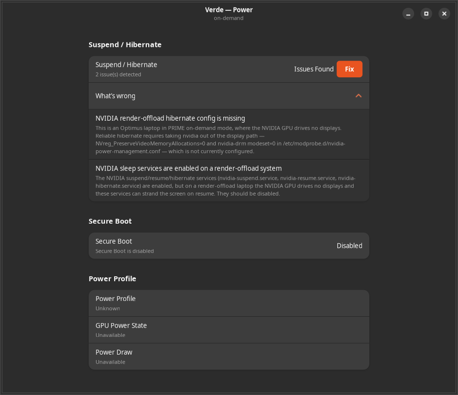
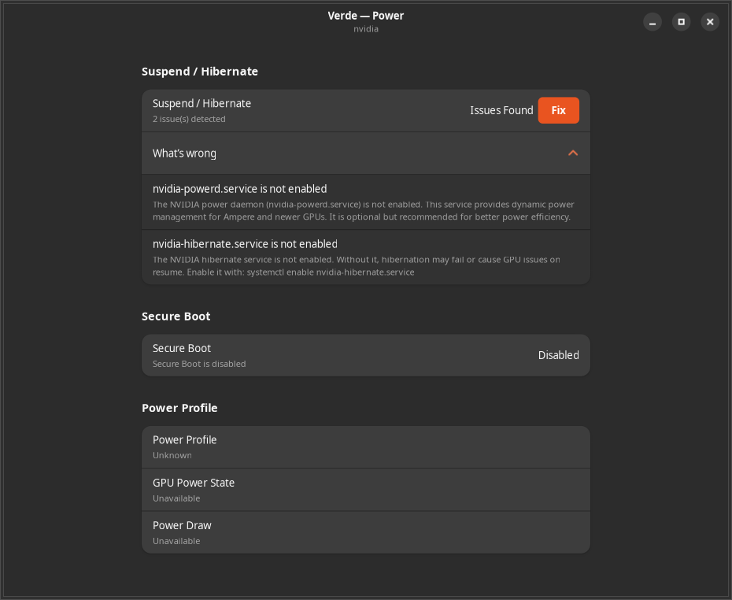

# NVIDIA GPU + hibernate on Ubuntu 24.04 (Optimus laptop)

## Machine

- Laptop, NVIDIA Optimus: GeForce 840M (Maxwell, 2 GB) + Intel Haswell HD 4400 iGPU. Intel drives all displays; the 840M drives no outputs (compute/offload only).
- Ubuntu 24.04, dual-boot Windows on legacy BIOS (no UEFI/Secure Boot).

## Part 1 — Getting the GPU to work

**Symptom:** `nvidia-smi` failed ("couldn't communicate with the NVIDIA driver"). The `nvidia-driver-535` packages were installed but the kernel module was never built (`dkms status` showed `added`, not `installed`).

**Root cause:** the machine was running kernel 5.15 (Ubuntu 22.04's kernel) on 24.04, and the 5.15 headers aren't in the 24.04 repos, so DKMS could never compile the module.

**Fix:** install the distro's 6.8 kernel + headers, which triggers DKMS to build the module, then make 6.8 the default and reboot:

```bash
sudo apt update && sudo apt install -y linux-generic
sudo sed -i 's/^GRUB_DEFAULT=.*/GRUB_DEFAULT=0/' /etc/default/grub
sudo update-grub
sudo reboot
```

Verify: `nvidia-smi` shows the 840M; `dkms status` shows `installed` for 6.8.

**Usage**

- Offload an app to the NVIDIA GPU (X11): `__NV_PRIME_RENDER_OFFLOAD=1 __GLX_VENDOR_LIBRARY_NAME=nvidia <app>` (convenience wrapper at `/usr/local/bin/prime-run`).
- GPU in Docker: install `nvidia-container-toolkit`, then `docker run --gpus all …`.

## Part 2 — Fixing hibernate

**Symptom:** after the GPU worked on 6.8, hibernate broke (it had worked on 5.15 only because the nvidia module wasn't loaded there). Two failures:

1. With `NVreg_PreserveVideoMemoryAllocations=1`: the freeze aborted — `nvidia PM: pci_pm_freeze returns -5`, "System Power Management attempted without driver process".
2. With `=0`: hibernate saved & powered off, but resume hung at a black console (system came back — cupsd ran — but the GUI never repainted).

**Root cause:** the 840M drives no displays, but `nvidia-drm modeset=1`/`fbdev=1` plus Ubuntu's PRIME on-demand put the nvidia GPU into the display/KMS path anyway. On resume the display handoff wedged trying to restore the now-invalid nvidia display device.

**Fix:** take nvidia out of the display path. Set `/etc/modprobe.d/nvidia-power-management.conf` to exactly:

```
options nvidia NVreg_PreserveVideoMemoryAllocations=0 NVreg_TemporaryFilePath=/var/tmp
options nvidia-drm modeset=0
```

Disable the nvidia sleep services (their chvt-63 VT dance can also strand the screen):

```bash
sudo systemctl disable --now nvidia-suspend.service nvidia-hibernate.service nvidia-resume.service
```

Rebuild initramfs and reboot:

```bash
sudo update-initramfs -u -k all
sudo reboot
```

**Result:** hibernate + resume work from both `systemctl hibernate` and the GNOME button. CUDA and X11 `prime-run` offload still work; only Wayland-native offload is given up (irrelevant on X11).

**Caveat:** a future NVIDIA driver update may rewrite that `.conf` and drop `modeset=0`, re-breaking hibernate — reapply the two lines and `sudo update-initramfs -u -k all`.

**Bulletproof fallback:** `sudo prime-select intel && sudo reboot` takes nvidia fully out of the picture (matches the original working 5.15 state); switch back with `sudo prime-select on-demand && sudo reboot` when you need the GPU.

## How this relates to Verde

Verde (this project) automates exactly this class of fix — its daemon detects and one-click-repairs NVIDIA suspend/hibernate problems. The relevant logic lives in [`src/verde-daemon/power_manager.py`](../src/verde-daemon/power_manager.py), which manages the same things this note edits by hand:

- the modprobe config at `/etc/modprobe.d/nvidia-power-management.conf` (`MODPROBE_CONF_PATH`);
- the `NVreg_PreserveVideoMemoryAllocations` / `NVreg_TemporaryFilePath` module options;
- the `nvidia-suspend` / `nvidia-hibernate` / `nvidia-resume` systemd services;
- and `nvidia-drm modeset`.

**The tension this note exposes.** Verde's original suspend/hibernate fix targeted the *standard* configuration — where the NVIDIA GPU drives displays. It wrote `NVreg_PreserveVideoMemoryAllocations=1` (plus `NVreg_TemporaryFilePath`) and enabled the nvidia sleep services; separately, its Wayland check flags a missing `nvidia-drm modeset=1` as a critical issue. On an **Optimus laptop where the NVIDIA GPU drives no displays** (this machine — PRIME `on-demand`, render-offload only), that is the *opposite* of what makes hibernate reliable: here you want nvidia taken *out* of the display/KMS path (`PreserveVideoMemoryAllocations=0`, `modeset=0`, nvidia sleep services disabled), as described above.

To resolve this, Verde now detects the display profile from the PRIME mode (`prime-select query`) and adapts its recommendation:

| PRIME mode | GPU drives displays? | Verde's hibernate/suspend fix |
|------------|----------------------|-------------------------------|
| `nvidia`   | yes                  | Standard: `PreserveVideoMemoryAllocations=1` + `TemporaryFilePath`, enable nvidia sleep services |
| `on-demand` | no (offload only)   | Offload-safe: `PreserveVideoMemoryAllocations=0`, `nvidia-drm modeset=0`, disable nvidia sleep services |
| `intel`    | nvidia off entirely  | Nothing to fix — hibernate already works |

So on this laptop Verde's guidance now matches the manual fix documented above rather than fighting it.

Verde's **Power** view adapts its detection and one-click fix to the detected profile:

| Render-offload (PRIME `on-demand`) | Standard (PRIME `nvidia`) |
|:----------------------------------:|:-------------------------:|
|  |  |
| Flags the missing render-offload config (`PreserveVideoMemoryAllocations=0`, `nvidia-drm modeset=0`) and the enabled sleep services. | Falls back to the standard guidance — enable `nvidia-hibernate.service`. |
